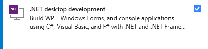
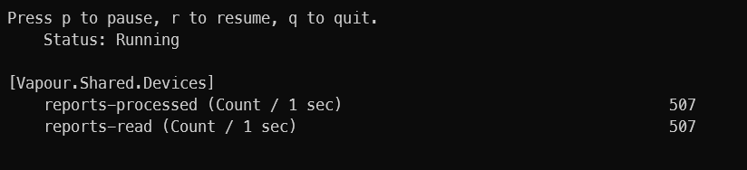
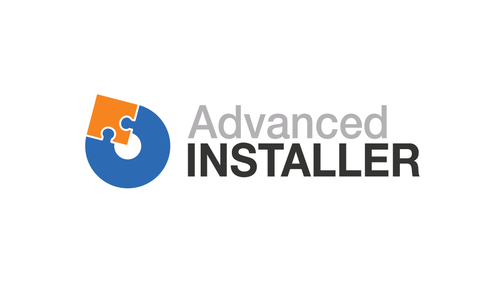

# Codename: Vapour Input

[](https://ci.appveyor.com/project/nefarius/ds4windows)
[](https://github.com/dotnet/core/blob/main/release-notes/8.0/supported-os.md) <!-- --> 

A reimagination of DS4Windows.

---

☣️ **Highly unstable, work-in-progress, constantly changing, incubating software ahead** ☣️

⚠️ **DO NOT USE UNSUPERVISED** ⚠️

## Disclaimers

- ⚠️ Might crash your system (BSOD)!
- ⚠️ May or may not launch/work/crash!
- ⚠️ Use at your own risk!
- ⚠️ No support provided whatsoever!

## About this fork

👉 [Very sporadically updated development blog](https://github.com/CircumSpector/DS4Windows/discussions/21).

### What this is

Over its lifespan of of *nearly a decade* DS4Windows has seen many contributors, changes, fixes, feature additions and has grown and kept relevant to gamers who'd love more control over their beloved peripherals. Beginning with the PS4 Controller (DualShock 4) it nowadays also supports its successor the PS5 DualSense and even the Nintendo JoyCons. With age and popularity come new challenges. The code has become more powerful, but also more troublesome to maintain and carries a lot of legacy design patterns and restraints from an outdated .NET universe. Here's where we step in.

[CircumSpector](https://github.com/CircumSpector) is a collective of enthusiasts craving to see DS4Windows continued. We attempt to rewrite major sections of the dated code segments to make maintenance and new feature additions fun again. This will take some time and a lot will probably break - intentionally or unintentionally so sooner or later we need a bigger test squad. For now, the issue tracker and discussions remain *collaborators only* to avoid bug reports for things we already know so we can focus on the code and nothing else.

In October 2022 we started a rebranding which includes an intermediate project name change to further distance this work from the current dominant and maintained DS4Windows version(s). An official new app name is yet to be settled on.

<!--
### What this is NOT

As of time of writing we don't strife to be considered the "new maintainers" and dethrone [Ryochan7](https://github.com/Ryochan7/DS4Windows) who's on a well-deserved hiatus from the project for a yet to be known duration (disclaimer: we don't speak on behalf of Ryochan7, we're merely observers as well). Time will tell if Ryochan7 comes back from a vacation and continues working on DS4Windows with help from the members of [CircumSpector](https://github.com/CircumSpector).
-->
## Where are the download links

There are none. Until this message changes, the rework is in constant motion and there is no value for us to provide binaries at this point. Feel free to clone and build yourself if you're brave 😜

## Where can I get more information

[Join our Discord server](https://discord.nefarius.at/) 🎉

## Contributing

If you are a **developer** looking to join the team just drop @nefarius a message! ⌨️

If you **want to see this project succeed** give it a GitHub star to show interest! ❤️

## How to build

- Get [Visual Studio 2022](https://visualstudio.microsoft.com/vs/community/) (Community Edition is fine)
- Install ".NET desktop development" workload  
  
- Install latest [.NET 8 SDK](https://dotnet.microsoft.com/en-us/download/dotnet/8.0)
- Build the solution in Visual Studio
  - Dependencies are pulled in automatically via NuGet
- To create a production release, use the command line:  
  `dotnet publish /p:PublishProfile=Properties\PublishProfiles\release-win-x64.pubxml`  
  ⚠️ this will fail when triggered via Visual Studio due to a pending issue ⚠️

## Architecture

The project components heavily depend on the use of [Inversion of Control (IoC a.k.a. Dependency Injection)](https://learn.microsoft.com/en-us/dotnet/core/extensions/dependency-injection) and code fitting a certain category is grouped by using separate class library projects. [Reflection](https://learn.microsoft.com/en-us/dotnet/csharp/programming-guide/concepts/reflection) is used to auto-discover certain types and assets to load automatically on app start (like icons and images for supported controllers), areas depending on performance utilize [Source Generators](https://learn.microsoft.com/en-us/dotnet/csharp/roslyn-sdk/source-generators-overview).

### Projects

#### Vapour.Server.Host

The heavy lifting (device detection, device hiding, spawning emulated devices, remapping, managing profiles, storing configuration, ...) is done by a Windows Service which is designed to run in the background and get started on boot. Tasks which require administrative permissions are all handled by the service, which eliminates the need of having to start the UI process(s) with elevated privileges. Running as a service allows to easily support multiple local user accounts who may or might not want to share profiles and other configuration. It also makes the remapping engine available immediately without having to wait for the frontend to auto-start.

Configuration changes use a request-response-pattern via HTTP REST interfaces using ASP.NET Core, events are exchanged via SignalR using WebSockets. By using standards it's ensured that potential 3rd party implementations can build upon the interfaces the service exposes. The client UI uses and conforms to said interfaces.

#### Vapour.Client

GUI frontend of the solution. Used to display status about connected devices, the active configuration and more.

#### Vapour.Client.TrayApplication

Slim tray notification area application for accessing common actions and an overview of basic stats.

#### Vapour.Client.*

Class libraries holding logic and components primarily required by the client (UI) applications.

#### Vapour.Shared.*

Class libraries holding logic and components required by both server and client applications.

## Diagnostics

### Performance counters

Make sure to have the [`dotnet-counters`](https://learn.microsoft.com/en-us/dotnet/core/diagnostics/dotnet-counters#install) installed. If the server service runs as Windows Service or in an elevated shell, make sure to run the following command in an elevated terminal as well:

```PowerShell
dotnet counters monitor -n Vapour.Server.Host --counters Vapour.Shared.Devices
```

This will display snapshots of the captured metrics.



This example shows that we're reading and processing 507 input reports per second, so one report roughly every 2 milliseconds.

## Sponsors

[](https://www.jetbrains.com/resharper/) [](https://www.advancedinstaller.com/)

## Sources & 3rd party credits

This application benefits from these awesome projects ❤ (appearance in no special order):

### IPC (HTTP, WebSockets)

- [FastEndpoints](https://fast-endpoints.com/)
- [Polly](https://github.com/App-vNext/Polly/)
- [Polly.Contrib.WaitAndRetry](https://github.com/Polly-Contrib/Polly.Contrib.WaitAndRetry)
- [Swashbuckle.AspNetCore](https://github.com/domaindrivendev/Swashbuckle.AspNetCore)
- [NSwag](https://github.com/RicoSuter/NSwag)
- [Serilog.AspNetCore](https://github.com/serilog/serilog-aspnetcore)

### UI/UX

- [Hardcodet NotifyIcon for WPF](https://github.com/hardcodet/wpf-notifyicon)
- [Material Design In XAML Toolkit](https://github.com/MaterialDesignInXAML/MaterialDesignInXamlToolkit)
- [Material Design Extensions](https://spiegelp.github.io/MaterialDesignExtensions/)

### Data transformation, source generators

- [AutoMapper](https://automapper.org/)
- [FastDeepCloner](https://github.com/AlenToma/FastDeepCloner)
- [C#/Win32 P/Invoke Source Generator](https://github.com/Microsoft/CsWin32)
- [Fody](https://github.com/Fody/Fody)
- [PropertyChanged.Fody](https://github.com/Fody/PropertyChanged)
- [ConfigureAwait.Fody](https://github.com/Fody/ConfigureAwait)

### Device handling, driver interaction

- [Nefarius.Drivers.HidHide](https://github.com/nefarius/Nefarius.Drivers.HidHide)
- [Nefarius' Identinator](https://docs.nefarius.at/projects/Identinator/)
- [Nefarius.Utilities.DeviceManagement](https://github.com/nefarius/Nefarius.Utilities.DeviceManagement)
- [ViGEm Client .NET SDK](https://github.com/ViGEm/ViGEm.NET)
- [Nefarius.Utilities.Bluetooth](https://github.com/nefarius/Nefarius.Utilities.Bluetooth)

### Logging, diagnostics

- [Serilog](https://serilog.net/)
- [OpenTelemetry](https://opentelemetry.io/)

### Processes, games

- [Warden.NET](https://github.com/RainwayApp/warden)
- [Vdf.NET](https://github.com/shravan2x/Gameloop.Vdf)

### Research, references

- [DS4Windows (Ryochan7 Edition)](https://github.com/Ryochan7/DS4Windows)
- [Game Controller Collective Wiki - Sony DualShock 4](https://controllers.fandom.com/wiki/Sony_DualShock_4)
- [Game Controller Collective Wiki - Sony DualSense](https://controllers.fandom.com/wiki/Sony_DualSense)
- [DSAdvance](https://github.com/r57zone/DSAdvance)
- [JoyShockLibrary](https://github.com/JibbSmart/JoyShockLibrary)
- [XInputHooker](https://github.com/nefarius/XInputHooker)
- [OpenXinput](https://github.com/Nemirtingas/OpenXinput)
- [SharpXusb](https://github.com/TheNathannator/SharpXusb)
